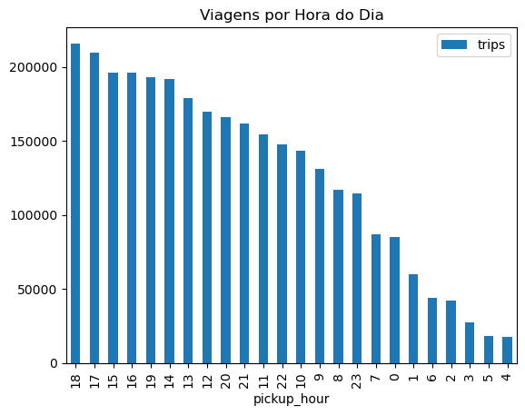

# Análise de Viagens de Táxi em Nova York com DuckDB + Python

Projeto completo de portfólio de Cientista de Dados/Analista de Dados.

## 🎯 Objetivo
Análise exploratória de **+3 milhões de viagens** de táxi amarelo em NYC (janeiro/2023) usando:
- **DuckDB** para consultas SQL eficientes diretamente em arquivo Parquet remoto (sem download)
- **Python + Pandas** para resumo estatístico e visualizações
- Consulta via HTTP: zero armazenamento local

## 🚀 Tecnologias
- DuckDB (SQL analítico puro: CTEs, window functions)
- Pandas & Matplotlib
- Jupyter Notebook

## 📊 Principais Insights
- Mais de 3 milhões de viagens e receita total de ~$100M+
- Pico de demanda às 18h (quase 200k viagens)
- Gorjeta média ~18% do valor da corrida
- Rotas mais lucrativas concentram-se em Manhattan (aeroportos e centros)

## 🛠️ Como Executar
1. Clone o repositório
2. `pip install -r requirements.txt`
3. Abra `nyc_taxi_analysis.ipynb` no VS Code/Jupyter
4. Execute todas as células → CSVs gerados automaticamente em `/resultados`

## 📈 Resultados
- [Schema do dataset](resultados/dataset_schema.csv)
- [Estatísticas básicas](resultados/trip_summary.csv)
- [Padrões por hora](resultados/hourly_patterns.csv)
- [Top rotas](resultados/top_routes.csv)

Projeto 100% reproduzível · Ideal para entrevistas de Data Analytics/Science